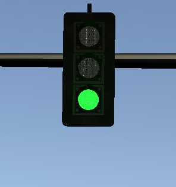

# Udacity Self-Driving Car Engineer Nanodegree
------------

### Team name: Driving app

| Name       | email          |
| --------------- |:---------------:|
| Noriaki Hori|nori.h.nori@gmail.com|
| Alexey Sas |asasryl@gmail.com|
| Andy Jang |  aj4834247@gmail.com|
| Shuyao Xu|seanxu1015@gmail.com|

### 

# Classifier Progress
-  
-  
-  
Running Instructions

# Install memo

- 1.Ubuntu 16.04 
- 2.ROS Kinetic if you have Ubuntu 16.04.
- 3.One Line SDK Install (binary)
- 4.Udacity Simulator.    
chmod a+x sys_int.x86_64  
- 5.git clone https://github.com/udacity/CarND-Capstone.git  
- 6.Install python dependencies  
cd CarND-Capstone  
pip install -r requirements.txt  
- 7.Make and run styx  
- 7-1 new terminal1  
cd ros  
source devel/setup.sh  
catkin_make  
roslaunch launch/styx.launch  

- 7-2 new terminal2(Udacity Simulator)  
./sys_int.x86_64 
